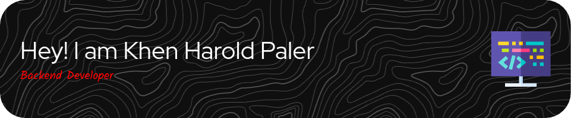

<h3 align="center">A passionate 4th-year BS in Information Technology student from Philippines</h3>

  

- 🔭 I’m currently working on **nextjs**

- 🌱 I’m currently learning **nextjs, typscript, tailwind**

- 📫 How to reach me **palerkhen40@gmail.com**

- ⚡ Fun fact **tiktokreels**

<h3 align="left">Connect with me:</h3>

<h3 align="left">Languages and Tools:</h3>

        

&nbsp;

