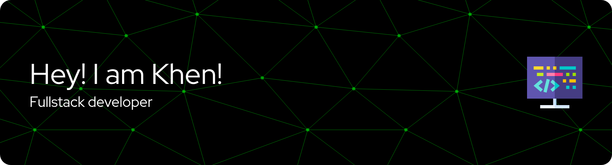

<h3 align="center">🌟 A passionate 4th-year BS in Information Technology student from the Philippines 🌟</h3>  

  

👨‍💻 About Me:

- 🔭 I’m currently working on Vue.js projects
  
- 🌱 I’m currently learning Vue.js, TypeScript, and Tailwind CSS
  
- 📫 Reach me at palerkhen40@gmail.com
  
- ⚡ Fun fact: I enjoy creating TikTok reels

🤝 Connect with Me:

   

🛠️ Languages and Tools:

        

📊 GitHub Stats:

  
       
  

